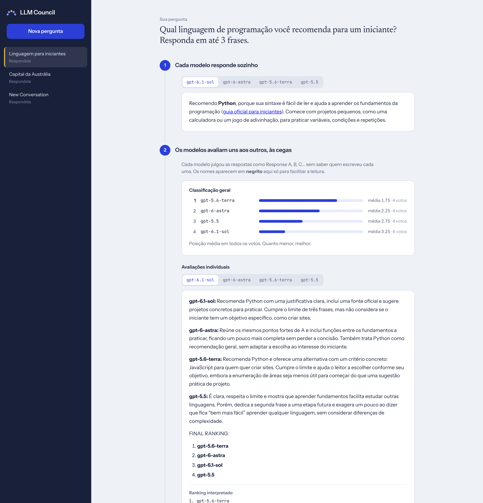
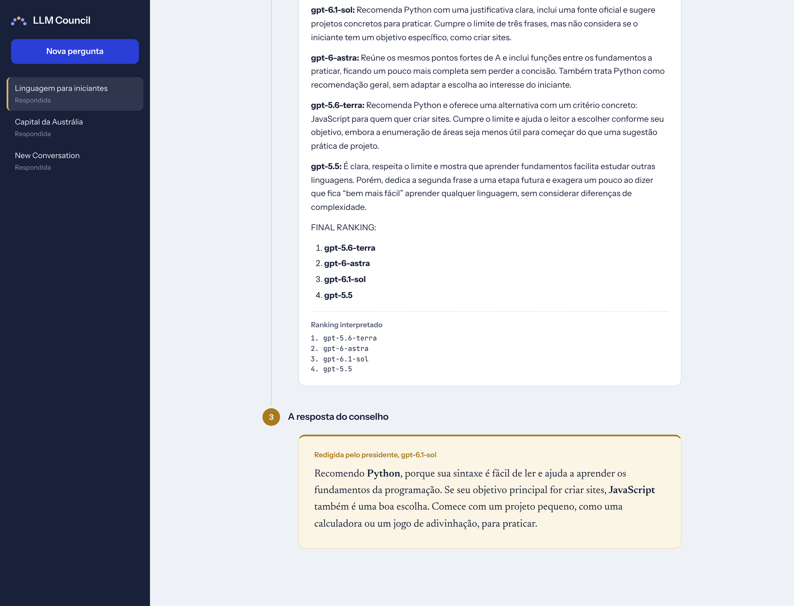

# LLM Council (fork com Codex CLI)


Fork do [karpathy/llm-council](https://github.com/karpathy/llm-council). A ideia continua a mesma: em vez de perguntar a um único modelo, você leva a pergunta a um "conselho" de LLMs.

1. **Etapa 1:** cada modelo responde sozinho.
2. **Etapa 2:** os modelos avaliam e ranqueiam as respostas uns dos outros, às cegas (as respostas viram "Response A, B, C…").
3. **Etapa 3:** um modelo presidente lê tudo e redige a resposta final.

## Começando: passo a passo

O LLM Council não usa chave de API. Ele conversa com os programas de IA que você já tem instalados e logados no seu computador. Você precisa de **pelo menos um** deles; quanto mais tiver, mais variado fica o conselho.

### Instalação automática (recomendado)

Um comando só instala tudo o que falta (Git, Node.js, uv), baixa o projeto, instala as dependências, pergunta quais programas de IA você quer instalar (incluindo a Antigravity CLI, `agy`), abre o login de cada um e já inicia o app.

**Windows:** abra o **Prompt de Comando** (tecla Windows, digite **cmd**, Enter), cole o comando abaixo e aperte Enter:

```bash
powershell -ExecutionPolicy Bypass -c "irm https://raw.githubusercontent.com/reimon/llm-council/master/install.ps1 | iex"
```

Se aparecer **"Access is denied"** e o projeto já estiver baixado, rode o instalador local dentro da pasta `llm-council`:

```bash
powershell -NoProfile -ExecutionPolicy Bypass -File .\install.ps1
```

Se o acesso continuar negado, confira as políticas do PowerShell:

```bash
powershell -NoProfile -Command "Get-ExecutionPolicy -List"
```

**macOS / Linux:** abra o **Terminal** e rode:

```bash
curl -fsSL https://raw.githubusercontent.com/reimon/llm-council/master/install.sh | bash
```

Durante a instalação:
- Se o Windows perguntar se permite alterações, clique em **Sim**.
- Para cada programa de IA, responda **S** (instalar) ou **n** (pular). Você precisa de pelo menos um. O login abre no navegador ou no próprio terminal.
- O projeto fica em `C:\Users\SEU-USUARIO\llm-council` (Windows) ou `~/llm-council` (macOS/Linux).
- Pode rodar o mesmo comando de novo a qualquer hora: ele só instala o que falta e atualiza o projeto.

Quando aparecer **"LLM Council is running!"**, abra **http://localhost:5173**. Deixe o terminal aberto enquanto usa o app; para parar, aperte **Ctrl+C**.

**Para abrir de novo outro dia** (sem reinstalar), na pasta do projeto:
- Windows: `powershell -ExecutionPolicy Bypass -File .\start.ps1`
- macOS / Linux: `./start.sh`

### Instalação manual

Se preferir instalar cada coisa à mão, siga os passos **na ordem**. Cada passo termina com um comando de conferência: só avance quando ele funcionar.

> **Regra de ouro:** depois de instalar qualquer programa (Git, Node.js, uv), **feche o terminal e abra de novo**. Sem isso, o terminal não enxerga o programa novo e aparece "is not recognized" (Windows) ou "command not found" (macOS/Linux).

<details>
<summary><strong>Windows: instalação manual</strong></summary>

#### Passo 0. Abrir o Prompt de Comando

1. Aperte a tecla **Windows**, digite **cmd** e clique em **Prompt de Comando**.
2. Para colar um comando no Prompt: copie aqui no README e clique com o **botão direito** dentro da janela preta (ou aperte **Ctrl+V**). Depois aperte **Enter**.
3. Rode **um comando por vez** e espere terminar antes do próximo.

> Toda vez que este guia disser **"reabra o Prompt"**: feche a janela do Prompt de Comando e abra uma nova (passo 0). É isso que faz o Windows enxergar um programa recém-instalado.

#### Passo 1. Instalar o Git (baixa o projeto)

```bash
winget install --id Git.Git -e
```

Se aparecer uma pergunta sobre aceitar os termos, digite **Y** e aperte Enter. Se o Windows perguntar se permite alterações, clique em **Sim**.

*Sem winget?* Baixe em https://git-scm.com/download/win, abra o arquivo e clique **Next** em todas as telas até **Install**, depois **Finish**.

**Reabra o Prompt** e confira (deve aparecer algo como `git version 2.x`):

```bash
git --version
```

#### Passo 2. Instalar o Node.js (traz o npm)

```bash
winget install --id OpenJS.NodeJS.LTS -e
```

*Sem winget?* Baixe a versão **LTS** em https://nodejs.org, abra o arquivo `.msi` e clique **Next** em todas as telas (deixe marcadas as opções padrão) até **Install**, depois **Finish**.

**Reabra o Prompt** e confira as duas coisas (cada uma deve mostrar um número de versão):

```bash
node --version
```

```bash
npm --version
```

#### Passo 3. Instalar o uv (roda o backend em Python)

```bash
winget install --id astral-sh.uv -e
```

*Sem winget?* Use:

```bash
powershell -ExecutionPolicy ByPass -c "irm https://astral.sh/uv/install.ps1 | iex"
```

**Reabra o Prompt** e confira:

```bash
uv --version
```

Você **não** precisa instalar o Python: o uv baixa a versão certa sozinho no passo 5.

#### Passo 4. Baixar o LLM Council

Vá para a sua pasta de usuário:

```bash
cd %USERPROFILE%
```

Baixe o projeto (se você já baixou antes, pule este comando):

```bash
git clone https://github.com/reimon/llm-council.git
```

Entre na pasta:

```bash
cd llm-council
```

Se você já tinha baixado antes, atualize para a versão mais nova:

```bash
git pull
```

#### Passo 5. Instalar as dependências do app

Backend (pode demorar alguns minutos na primeira vez):

```bash
uv sync
```

Frontend:

```bash
cd frontend
```

```bash
npm install
```

```bash
cd ..
```

Confira que existe a pasta `frontend\node_modules`:

```bash
dir frontend\node_modules
```

#### Passo 6. Instalar e fazer login em pelo menos um programa de IA

Você precisa de **pelo menos um**. Recomendado para começar: **Codex** (usa sua conta do ChatGPT).

**Codex (GPT):**

```bash
npm install -g @openai/codex
```

```bash
codex login
```

O navegador abre: entre com a sua conta do ChatGPT. Confira:

```bash
codex --version
```

**Claude Code (Claude)**, opcional:

```bash
npm install -g @anthropic-ai/claude-code
```

Se o npm avisar que bloqueou o script `postinstall` do Claude Code (`allow-scripts`), autorize os scripts desse pacote e reinstale:

```bash
npm config set allow-scripts=@anthropic-ai/claude-code --location=user
npm install -g @anthropic-ai/claude-code
```

```bash
claude
```

Siga o login que aparece na tela (conta Claude). Depois feche com **Ctrl+C** duas vezes.

**Antigravity CLI (Gemini)**, opcional: o LLM Council precisa da CLI `agy`; instalar apenas o Antigravity IDE não basta. Na pasta `llm-council`, rode este script no Prompt de Comando do Windows:

```bash
install-agy.cmd
```

Se aparecer a mensagem **"binary is not in your active PATH"**, a instalação foi concluída, mas o Prompt atual ainda não atualizou o caminho. Feche todas as janelas do Prompt, abra uma nova e confira com `where agy`.

Depois, confira se a CLI responde e faça o login Google na primeira execução:

```bash
agy --version
```

```bash
agy
```

O aplicativo Antigravity IDE pode ser instalado separadamente pela [página oficial](https://www.antigravity.google/download).

Se algum `npm install -g` der erro de permissão (`EPERM` ou `EACCES`), abra o Prompt **como administrador** (tecla Windows, digite **cmd**, clique com o botão direito em Prompt de Comando, **Executar como administrador**) e repita o comando.

#### Passo 7. Iniciar o app

Dentro da pasta `llm-council`:

```bash
powershell -ExecutionPolicy Bypass -File .\start.ps1
```

O script confere se uv, npm e as dependências estão instalados e diz o que falta. Quando aparecer **"LLM Council is running!"**, abra **http://localhost:5173** no navegador.

- **Deixe a janela do Prompt aberta** enquanto usa o app. Fechar a janela desliga o app.
- **Para parar:** clique na janela do Prompt e aperte **Ctrl+C**.
- **Para usar de novo outro dia:** abra o Prompt e rode só:

```bash
cd %USERPROFILE%\llm-council
```

```bash
powershell -ExecutionPolicy Bypass -File .\start.ps1
```

</details>

<details>
<summary><strong>macOS e Linux: instalação manual</strong></summary>

Use o **Terminal**.

**1. Git.** No macOS, rode `xcode-select --install` (instala o Git junto). No Linux, use o gerenciador de pacotes (ex.: `sudo apt install git`). Confira:

```bash
git --version
```

**2. Node.js.** Baixe a versão **LTS** em https://nodejs.org (ou use `brew install node` no macOS). Reabra o Terminal e confira:

```bash
npm --version
```

**3. uv:**

```bash
curl -LsSf https://astral.sh/uv/install.sh | sh
```

Reabra o Terminal e confira:

```bash
uv --version
```

**4. Baixe o LLM Council:**

```bash
cd ~
```

```bash
git clone https://github.com/reimon/llm-council.git
```

```bash
cd llm-council
```

**5. Instale as dependências:**

```bash
uv sync
```

```bash
cd frontend && npm install && cd ..
```

**6. Instale e faça login em pelo menos um programa de IA** (veja [Programas de IA](#programas-de-ia) abaixo). Exemplo com o Codex:

```bash
npm install -g @openai/codex
```

```bash
codex login
```

**7. Inicie o app:**

```bash
./start.sh
```

Abra **http://localhost:5173** no navegador. Para parar, aperte **Ctrl+C** no Terminal.

</details>

**Opcional:** para anexar vídeos, instale o [ffmpeg](https://ffmpeg.org/download.html) (no macOS: `brew install ffmpeg`).

**Para atualizar** o LLM Council depois, dentro da pasta `llm-council`:

```bash
git pull
```

```bash
uv sync
```

```bash
cd frontend && npm install && cd ..
```

### Programas de IA

| Programa | Modelos | Instalar | Fazer login |
|---|---|---|---|
| **Codex CLI** | GPT (OpenAI) | `npm install -g @openai/codex` | `codex login` (conta ChatGPT) |
| **Claude Code** | Claude (Anthropic) | `npm install -g @anthropic-ai/claude-code` | rode `claude` e siga o login |
| **Antigravity CLI** | Gemini, Claude e outros | Windows: `install-agy.cmd` na pasta do projeto · macOS/Linux: `curl -fsSL https://antigravity.google/cli/install.sh \| bash` | rode `agy` e entre com a conta Google |
| **Gemini CLI** | Gemini (Google) | `npm install -g @google/gemini-cli` | chave gratuita (veja abaixo) |

- O login de cada um é feito **por você**, uma vez, no terminal ou no app. O LLM Council só usa o login que já existe.
- O uso conta no limite do seu plano em cada serviço (ChatGPT, Claude, Google).
- **Atenção:** o LLM Council usa os programas **de terminal**. O app de desktop do Claude não é o Claude Code, e o editor Antigravity (IDE) não traz o comando `agy`: instale-os como na tabela. Para conferir, rode `where claude` e `where agy` (Windows) ou `which claude` e `which agy` (macOS/Linux).
- **Gemini:** há dois caminhos.
  - **Antigravity:** funciona com o login normal da sua conta Google, mas leva de 40 a 60 segundos por resposta, mesmo para perguntas curtas. Se você não usa as ferramentas de dados do Google Cloud, desligar os servidores MCP da extensão Data Cloud (`agy mcp list` e `agy mcp disable <nome>`) acelera o início.
  - **Gemini CLI:** mais rápido, mas o Google **não aceita mais login com conta pessoal** nele (aparece "This client is no longer supported for Gemini Code Assist for individuals"). Ele só funciona com uma **chave de API gratuita**: crie em [aistudio.google.com/apikey](https://aistudio.google.com/apikey) e salve no arquivo `~/.gemini/.env` (no Windows, `%USERPROFILE%\.gemini\.env`) assim: `GEMINI_API_KEY=sua-chave`. Depois rode `gemini` uma vez e escolha **2. Use Gemini API Key**. A chave gratuita tem limite de uso.
- Todos rodam em modo **somente leitura**: podem ler as pastas que você indicar, mas não alteram nada.

### 8. Monte o seu conselho

**Jeito mais rápido:** na câmara, clique em **Configurar automaticamente**. O app procura os programas de IA instalados, testa cada um (só entra quem responde, ou seja, quem está logado), monta o **"Conselho automático"** com um papel diferente para cada conselheiro, escolhe o presidente (Claude Opus quando o Claude Code está disponível) e o deixa como padrão. Leva até alguns minutos. O mesmo pode ser feito pelo terminal, na pasta do projeto:

```bash
uv run python -m backend.autoconfig
```

O instalador automático já roda isso no final. Rode de novo sempre que instalar ou logar um programa novo.

Para ajustar à mão:


1. Clique em **Configurar conselho**. Você vê a mesa com o presidente (coroa) e os conselheiros.
2. Clique numa cadeira. Em **Onde roda**, escolha o programa; o app mostra só os instalados e avisa **"Precisa de chave"** quando falta a chave do Gemini CLI.
3. Escolha o **modelo** e clique em **Testar conexão**. Se aparecer "Respondeu em Xs", está tudo certo.
4. Escolha o **papel** (Contrário, Executor…) e, se quiser, adicione **skills** pela **Biblioteca de skills**.
5. Clique em **Salvar conselho**. Você pode criar vários conselhos (ex.: "Produto", "Código", "Rápido") com **+ Novo conselho**.

### 9. Faça perguntas

- **Nova pergunta:** pergunta geral. No campo de pergunta, escolha qual conselho responde e use **+** para anexar imagens, vídeos, pastas ou links.
- **Projetos → Adicionar:** cadastre a pasta de um projeto; nos chats dele, os modelos leem o código antes de responder.
- Enquanto o conselho delibera, a cena 3D mostra cada modelo trabalhando, e cada resposta aparece assim que o modelo termina.

### Se algo não funcionar

| Sintoma | O que fazer |
|---|---|
| Programa aparece como "Não instalado" | Confira num terminal **novo** se ele responde (ex.: `codex --version`). Se não responder, instale e faça login. Se responder, pare o app (Ctrl+C) e inicie de novo nesse terminal novo. |
| Antigravity aparece como "Não instalado" | O painel precisa da CLI `agy`, não só do Antigravity IDE. Na pasta `llm-council`, rode `install-agy.cmd`, conclua o login Google e reinicie o LLM Council. Depois clique em **Configurar automaticamente**. |
| "Precisa de chave" no Gemini CLI | Crie a chave gratuita e salve em `~/.gemini/.env` (passo 2). Login com conta Google não funciona mais. |
| "This client is no longer supported…" ao logar no Gemini CLI | O Google descontinuou o login pessoal. Use a chave de API ou o Antigravity. |
| Uma cadeira aparece com erro | Use **Testar conexão** nela. Se falhar, refaça o login daquele programa. |
| Gemini pelo Antigravity muito lento | É o tempo do próprio Antigravity. Use o Gemini CLI ou crie um conselho "rápido" sem ele. |
| Tokens mostrados com "~" | São estimativas pelo tamanho da resposta. Claude Code e Antigravity informam o uso real, que aparece sem "~" (passe o mouse para ver entrada, saída e pensamento). O Codex não informa, então fica estimado. |
| Página não carrega os dados | Confira se o backend está rodando (`./start.sh`) e use http://localhost:5173. |
| "is not recognized" / "command not found" (uv, npm, git, codex…) | O programa não está instalado ou o terminal foi aberto antes de instalar. Instale e **reabra o terminal**. |
| Windows: `Start-Process … npm.cmd … cannot find the file` | O Node.js não está instalado. Instale a versão LTS de nodejs.org, reabra o Prompt e confira com `npm --version`. |
| "address already in use" / porta 8001 ou 5173 ocupada | Uma tentativa anterior deixou o app rodando. Feche o terminal antigo (ou reinicie o computador) e inicie de novo. |
| `npm install -g` dá erro de permissão | Windows: abra o Prompt como administrador. macOS/Linux: veja https://docs.npmjs.com/resolving-eacces-permissions-errors-when-installing-packages-globally |

## O que muda neste fork

### Roda com o Codex CLI, sem chave de API

O original usa a OpenRouter, que exige `OPENROUTER_API_KEY` e créditos. Aqui o padrão é o [Codex CLI](https://github.com/openai/codex) instalado na sua máquina, usando o login da sua conta ChatGPT.

- Novo cliente em `backend/codex_client.py`, com a mesma interface do `openrouter.py` (`query_model` e `query_models_parallel`). Cada consulta roda `codex exec` em modo somente leitura e sem salvar sessão.
- `backend/config.py` ganhou `LLM_PROVIDER` (`codex` por padrão) e `CODEX_BIN`.
- O modelo que gera títulos de conversa saiu do código fixo e virou `TITLE_MODEL` na config.

Modelos padrão com o Codex:

| Papel      | Modelos                                                   |
|------------|-----------------------------------------------------------|
| Conselho   | `gpt-6.1-sol`, `gpt-6-astra`, `gpt-5.6-terra`, `gpt-5.5`  |
| Presidente | `gpt-6.1-sol`                                             |
| Títulos    | `gpt-6-luna`                                              |

Limitações:
- O Codex só oferece modelos da OpenAI disponíveis no seu plano. Gemini, Claude e Grok ficam de fora.
- Cada consulta abre um processo `codex`, então é mais lento que a API. O tempo limite por consulta é de 300s.
- O uso conta no limite do seu plano ChatGPT.

Para voltar à OpenRouter, coloque no `.env`:

```bash
LLM_PROVIDER=openrouter
OPENROUTER_API_KEY=sk-or-v1-...
```

### Câmara do conselho: escolha quem senta à mesa

Em **Configurar conselho**, o conselho aparece como uma mesa redonda: o presidente com coroa no topo e cada conselheiro numa cadeira, na cor do seu papel. Clicando numa cadeira, você vê e muda:

- **Onde roda:** Codex CLI, Claude Code, Antigravity ou Gemini CLI (o app detecta quais estão instalados e lista os modelos de cada um).
- **Modelo:** escolhido numa lista com busca, e **Testar conexão** mostra se o modelo responde e em quanto tempo.
- **Papel no conselho:** muda o ângulo da resposta na etapa 1. A avaliação da etapa 2 continua neutra e às cegas.

| Papel | O que faz |
|---|---|
| Generalista | Responde direto, sem um ângulo específico |
| Contrário | Questiona premissas, procura riscos e cenários de falha |
| Primeiros princípios | Decompõe o problema até os fundamentos |
| Expansionista | Procura oportunidades e ideias ambiciosas |
| Olhar de fora | Traz outras áreas, casos análogos e comparações |
| Executor | Transforma a resposta em passos, metas e riscos |

Também dá para adicionar cadeiras, tirar alguém de uma sessão sem apagar a cadeira, tornar um conselheiro presidente e misturar provedores: por exemplo, GPT pelo Codex, Claude Sonnet pelo Claude Code e Gemini 3.1 Pro pelo Antigravity, com o Claude Opus presidindo. A configuração fica em `data/council.json`. Na etapa 1, cada aba mostra em que papel o modelo respondeu.

Requisitos: o `claude` (Claude Code), o `agy` (Antigravity) e o `gemini` (Gemini CLI) precisam estar instalados e logados. O Gemini CLI é bem mais rápido que o Antigravity para usar Gemini, mas precisa de uma chave de API gratuita do Google AI Studio. Ele roda no modo `plan`, que é somente leitura. Nenhum deles tem permissão de editar arquivos. O passo a passo de instalação e login está em [Começando](#começando-passo-a-passo).

### Vários conselhos salvos

Você pode montar e guardar vários conselhos, por exemplo um de **Produto** (PM, CEO e Voz do cliente), um de **Código** (Engenheiro sênior, Segurança e CTO) e um **rápido** com um só modelo leve. Cada um tem as suas cadeiras, papéis, skills e presidente.

- Na câmara, as abas no topo trocam de conselho. **+ Novo conselho** cria um copiando o atual ou começando do zero. O nome e a descrição são editáveis ali mesmo, e há **Usar como padrão** e **Apagar conselho**.
- No campo de pergunta, o seletor ao lado do **+** escolhe qual conselho responde aquela pergunta. Ele começa no conselho padrão.
- A pergunta salva mostra a qual conselho ela foi feita ("Perguntado a: Produto").

Os conselhos ficam em `data/councils.json`. Na primeira vez, o conselho que você já tinha vira o "Conselho principal".

### Skills: especialidades para os conselheiros

Na câmara, o botão **Biblioteca de skills** abre um catálogo de especialidades que você instala e depois dá a qualquer cadeira, inclusive ao presidente. Por exemplo: o Gemini como Contrário **com** as skills de PM e CEO.

As skills vêm só de duas fontes confiáveis:
- **Biblioteca do LLM Council:** 12 skills escritas neste projeto: Gerente de produto, CEO, CTO, CFO, Designer de UX, Marketing e crescimento, Segurança, Jurídico e compliance, Investidor, Cientista de dados, Engenheiro sênior e Voz do cliente.
- **Do seu computador:** os `SKILL.md` que você já instalou para o Claude Code, o Codex e plugins (`~/.claude/skills`, `~/.codex/skills`, `~/.agents/skills` e o cache de plugins do Claude). São lidos do disco, nunca baixados da internet.

Na etapa 1, as skills da cadeira entram como instruções extras junto com o papel. A avaliação às cegas da etapa 2 continua neutra. As skills do presidente valem na síntese final. A biblioteca instalada fica em `data/skills.json`.

### Perguntas sobre os seus projetos

Você pode cadastrar a pasta de um projeto e abrir vários chats dentro dele. Nesses chats, cada modelo do conselho lê os arquivos do projeto antes de responder.

- Na barra lateral, em **Projetos → Adicionar**, digite o caminho da pasta ou use **Escolher…**, que abre o seletor de pastas do macOS.
- Os chats ficam agrupados por projeto. O **+** ao lado do nome abre um chat novo naquele projeto.
- Nas três etapas, o Codex roda dentro da pasta do projeto (`-C <pasta>`) em modo **somente leitura**, então nada no projeto é alterado.
- Explorar código leva mais tempo: o limite por consulta sobe para 15 minutos nesses chats.
- Remover um projeto apaga os chats dele no LLM Council, mas não mexe na pasta do projeto.
- **Perguntas gerais**, fora de projetos, continuam funcionando como antes.

Os projetos ficam em `data/projects.json`, e cada conversa guarda o seu `project_id`. Isso funciona só com `LLM_PROVIDER=codex`, porque a OpenRouter não tem acesso a arquivos.

### Anexos: imagens, vídeos, pastas e links

O botão **+** no campo de pergunta abre o menu de anexos. Também dá para arrastar arquivos para o campo ou colar uma imagem.

- **Imagem:** vai direto para os modelos (`codex exec --image`).
- **Vídeo:** o Codex não lê vídeo, então o backend extrai 6 quadros em intervalos iguais com `ffmpeg` e envia como imagens, explicando que são quadros em ordem. Requer `ffmpeg` instalado.
- **Pasta:** os modelos recebem o caminho e podem ler os arquivos em modo somente leitura. O botão **Escolher…** abre o seletor do macOS.
- **Link:** o backend baixa a página, extrai o texto (até 20 mil caracteres) e o junta à pergunta.

Os anexos valem para as três etapas, assim quem avalia vê o mesmo material de quem respondeu. Os arquivos enviados ficam em `data/uploads/`, e a pergunta salva mostra os anexos usados.

### Novo design





A interface foi redesenhada com o tema de uma sessão de conselho:

- Barra lateral azul-marinho, com um logo de cinco assentos em semicírculo.
- A pergunta aparece em destaque, em serifa (Newsreader). A interface usa Instrument Sans.
- As três etapas viram uma linha do tempo numerada.
- As abas dos modelos viraram um seletor segmentado.
- A classificação geral aparece como barras e vem antes das avaliações individuais. Ela fica salva no histórico, então aparece também ao reabrir conversas antigas.
- A resposta final do presidente fica num cartão dourado, o único destaque forte da página.
- Foco visível pelo teclado, respeito a quem prefere menos animação e layout em uma coluna em telas estreitas.
- Os estilos estão concentrados em `frontend/src/index.css`, com tokens de cor no `:root`.

### Interface em português e inglês

A interface está em português (pt-BR) e inglês. O botão **EN / PT** ao lado do nome do app troca o idioma na hora, e a escolha fica salva no navegador. Na primeira visita, o idioma segue o do navegador. Os textos ficam em `frontend/src/i18n.jsx`.

## Sistemas operacionais

Funciona em **macOS**, **Linux** e **Windows**.

| | macOS | Linux | Windows |
|---|---|---|---|
| Iniciar | `./start.sh` | `./start.sh` | `.\start.ps1` (PowerShell) |
| Botão "Escolher…" de pasta | Nativo | `zenity` ou `kdialog` (senão, digite o caminho) | Nativo |
| Anexar vídeos | Requer `ffmpeg` | Requer `ffmpeg` | Requer `ffmpeg` no PATH |

- Os programas de IA (`codex`, `claude`, `agy`) são encontrados pelo PATH, inclusive os `.cmd` que o npm instala no Windows.
- Perguntas longas para o Antigravity vão por um arquivo temporário, porque ele só aceita a pergunta como argumento e o Windows limita o tamanho do comando.
- Os arquivos de dados são lidos e gravados em UTF-8 em todos os sistemas.
- Por segurança, o backend escuta só em `127.0.0.1`: ele usa os seus logins de IA e pode ler pastas locais, então não deve ficar acessível na rede. Para mudar, defina `LLM_COUNCIL_HOST`.

No Windows, se o PowerShell bloquear o script, rode `powershell -ExecutionPolicy Bypass -File .\start.ps1`.

## Stack

- **Backend:** FastAPI (Python 3.10+), Codex CLI ou OpenRouter via httpx
- **Frontend:** React + Vite, react-markdown
- **Armazenamento:** arquivos JSON em `data/conversations/`

## Créditos

Projeto original de [Andrej Karpathy](https://github.com/karpathy/llm-council), que o descreve como um hack de fim de semana sem suporte. Este fork mantém esse espírito.
